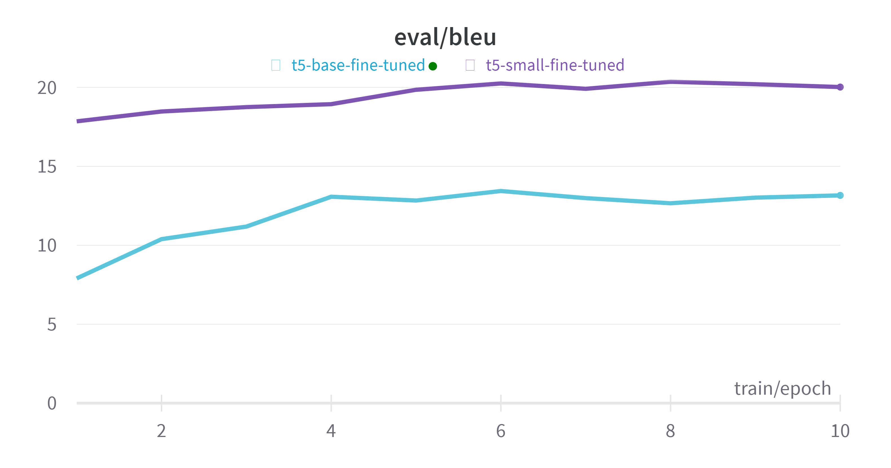

# Final Solution report.

## Introduction
This is the final solution report for the PMLDL course assignment, my first attempt at using LLM for the task this broad. I started with article on De-toxification. Really enjoyed data preparation, and getting acknowledged with more DS products such as "Weights &  Biases" and "Hugging Face" community. And from now on transformers are more clear to me.

## Data analysis
The dataset is a subset of the ParaNMT corpus (50M sentence pairs). The filtered ParaNMT-detox corpus (500K sentence pairs) was used for the assignment detoxification task. 
The data consists of 6 features:
- reference - original text
- ref_tox - toxicity level of reference text
- translation - paraphrazed version of the reference
- trn_tox - toxicity level of translation text
- similarity - cosine similarity of the texts
- lenght_diff - relative length difference between texts

While investigating the dataset, I have found that the data is not sorted yet to be ready for training. Also, looking back on the results of my model, and the fact that I applied cropped dataset, it would be better to choose the data with more toxicity level and not just randomly (the difference between toxicity levels might not significant).

## Model Specification
In final solution I have used T5-small transformer (the same as in lab about translating from English to Deutsch). 
You can find all the details on [Hugging Face website](https://huggingface.co/docs/transformers/model_doc/t5).

## Training Process
- Template from lab was used for training process, but with different parameters.
- The model was trained on 10 epochs, with batch size 16, and learning rate 0.1.
- For tracking the training process, I have used [Weights & Biases](https://wandb.ai/site) service. Also it was used for graphics and visualizations.
- The model was trained on Google Colab Pro, with GPU Tesla T4. (Approximately 1 hour for 10 epochs) for 50K dataset.

## Evaluation
For evaluation I have used the same metric as in lab - SACREBLEU. I have checked the final model on train and test datasets. The results are, to be honest, quite extraordinary.

## Results
The final model was trained on 50K dataset, and the results are (comparing to t5-base model):

Comparing to the  the article, the BLEU score is better. The reason for that is the size of the dataset. The bigger model requires more data to train on, but I'm limited by the hardware resources. 

As for the manual evaluation, I have checked the model on the sentences from the test and train datasets. The inference might be either very fluent or just gibberish. It is definitely interconnected to my dataset size, because 50K is not enough for the model to learn the context. But still, the results are quite good (You can see them in notebooks 3.0 and 4.0).
