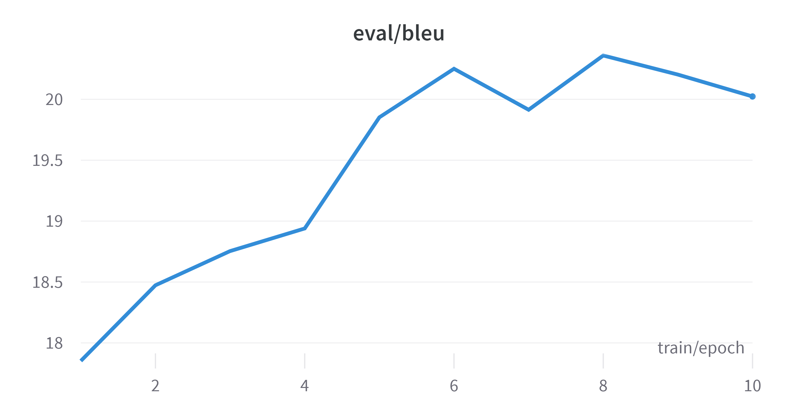

# PMLDL Solution Building Report

## Baseline: dictionary based.
The approach to classify all the toxic words and then to delete them from the text. This idea will significantly reduce toxicity, but it will lose the context for the sentences.

## Hypothesis 1: T5-small model fine-tuned.
The model, which we covered on the lab for translation English language to Deutsch. We will use it to translate toxic sentences to non-toxic. This includes tokenization, training and evaluation of pretrained model.

By the picture above we can see that the model is pretty good at translation. Within 10 epochs the BLEU score is ~20. The results from the given article were about 10-12 BLEU score. Also, I should mention that the model was trained not on the whole dataset, which is 50K sentences.

## Hypothesis 2: T5-base model fine-tuned.
I thought that the usage of the bigger model will improve the results. But it was not the case. The model was trained on the same dataset, but the results were worse. The BLEU score was about 9-13 depending on the run. I think that the reason for that is the size of the dataset. The bigger model requires more data to train on, but I'm limited by the hardware resources. Also, the model might be overfitted on the dataset.

## Hypothesis 3: GPT-2 model fine-tuned.

